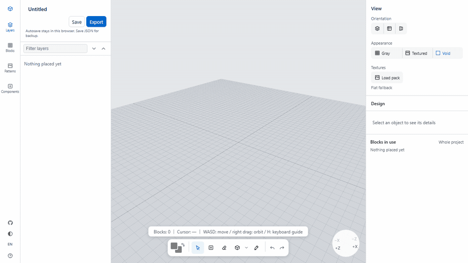

# Kigumi

A browser-based 3D editor for Minecraft Bedrock builders. Sketch with blocks, organize a build
with layers and groups, create natural material mixes, and export the result as a `.mcpack`.

**[Try Kigumi in your browser](https://martin-ushiyama.github.io/kigumi/)** ·
**[Japanese](README.ja.md)**



> Kigumi currently requires a desktop-sized screen, keyboard, and mouse or trackpad.

## What you can do

- Place, erase, select, move, duplicate, mirror, and fill block shapes in a 3D workspace.
- Keep larger builds manageable with nested layers, groups, visibility, and locking.
- Build reusable mix palettes such as 40% stone bricks, 30% cobblestone, 20% andesite, and
  10% mossy cobblestone. Each stroke draws from the mix by weight.
- Save an editable project as JSON or export a Minecraft Bedrock behaviour pack in one step.
- Work entirely in the browser. Project data and pack generation never require a backend.

## Saving a project

Kigumi autosaves in the current browser. Browser storage can be removed when site data is
cleared, when private browsing ends, or when the device is lost. Download a project JSON
regularly for backup. The same JSON file can be loaded on another computer or shared with
another builder; there is no server-side project sharing.

## Bringing a build into Minecraft

1. Choose **Export** and open the downloaded `.mcpack`. Minecraft imports it automatically.
2. Open the world's settings and enable the imported behaviour pack.
3. In the world, run `/structure load bs:<project-name>`.

## Textures and upstream data

The block catalogue and textures originate from Mojang's
[bedrock-samples](https://github.com/Mojang/bedrock-samples). Minecraft assets are not
redistributed in this repository. The hosted editor works with flat-colour fallbacks when those
assets are unavailable.

To use the original textures without uploading them anywhere, open **View → Textures → Load
pack** and choose a resource-pack `.zip` or `.mcpack`. Kigumi extracts only matching files below
`textures/blocks/` and stores them in this browser. The pack can be replaced or removed from the
same panel.

For local development, the pinned upstream snapshot and textures can be fetched separately:

```bash
npm run fetch-bedrock-snapshot
npm run fetch-textures
```

## Local development

Node.js 24 or newer is required.

```bash
npm ci
npm run dev      # http://localhost:5199
npm test
npm run build
```

See [CONTRIBUTING.md](CONTRIBUTING.md) before opening a pull request.

## Documentation

| Document | Contents |
|---|---|
| [docs/architecture.md](docs/architecture.md) | module boundaries and dependency rules |
| [docs/document-api.md](docs/document-api.md) | read and write boundaries for the editor model |
| [docs/bedrock-format.md](docs/bedrock-format.md) | Bedrock block states and `.mcstructure` output |
| [docs/design-system.md](docs/design-system.md) | interface design language |

## License and disclaimer

The source code is available under the [MIT License](LICENSE). Minecraft assets are not covered
by that license.

Kigumi is an unofficial fan-made tool. It is not approved by or associated with Mojang or
Microsoft. Minecraft and its related names, brands, and assets belong to their respective owners.
